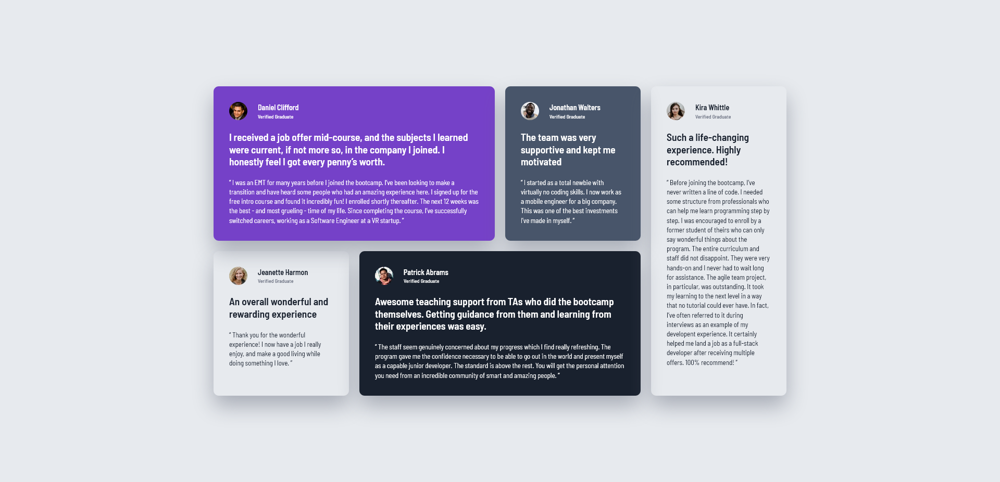

# Frontend Mentor - Testimonials grid section solution

This is a solution to the [Testimonials grid section challenge on Frontend Mentor](https://www.frontendmentor.io/challenges/testimonials-grid-section-Nnw6J7Un7).  

## Table of contents

- [Overview](#overview)
  - [The challenge](#the-challenge)
  - [Screenshot](#screenshot)
  - [Links](#links)
- [My process](#my-process)
  - [Built with](#built-with)
  - [Useful resources](#useful-resources)
- [Author](#author)

**Note: Delete this note and update the table of contents based on what sections you keep.**

## Overview

### The challenge

Users should be able to:

- View the optimal layout for the site depending on their device's screen size

### Screenshot

### Links

- Solution URL: https://github.com/jgoryca/testimonials-grid-section
- Live Site URL: https://jgoryca.github.io/testimonials-grid-section/

## My process

### Built with

- Semantic HTML5 markup
- CSS
- SASS
- Flexbox
- CSS Grid
- Mobile-first workflow

### Useful resources

- https://developer.mozilla.org/
- https://courses.kevinpowell.co/view/courses/conquering-responsive-layouts
- https://www.joshwcomeau.com/css/interactive-guide-to-flexbox/
- https://www.joshwcomeau.com/css/interactive-guide-to-grid/

## Author

- LinkedIn - https://www.linkedin.com/in/jaroslawgoryca/
- Frontend Mentor - https://www.frontendmentor.io/profile/jgoryca
